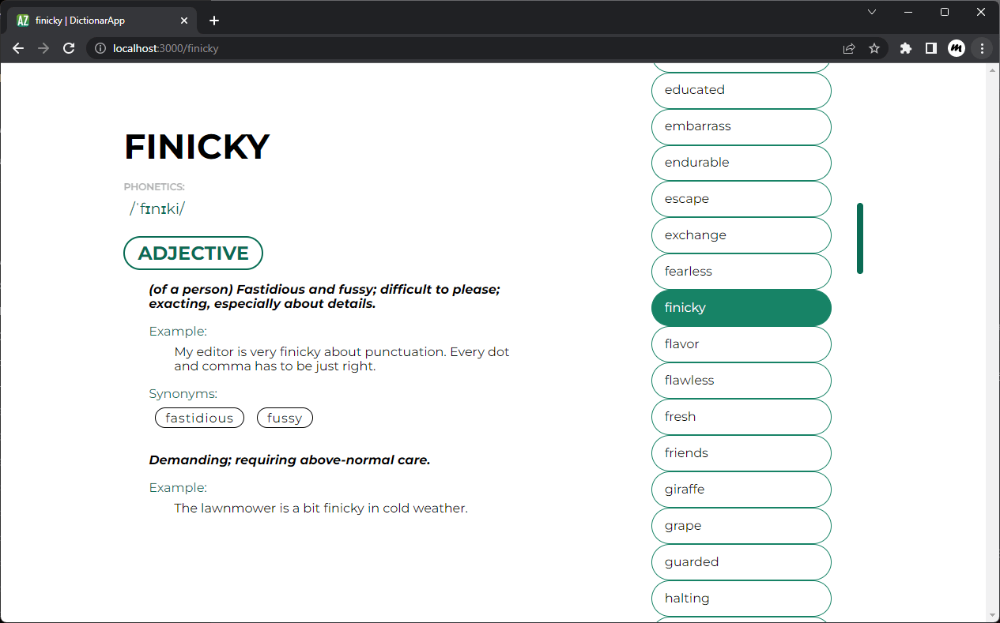

# DictionarApp



## <small>`DEV 👨‍💻`</small>

```bash
$ npm install
$ npm run dev
# serve with hot reload at localhost:3000
```

## <small>`BUILD 🏃`</small>

```bash
$ npm install
$ npm run build
$ npm run start
# build for production and launch server
```
